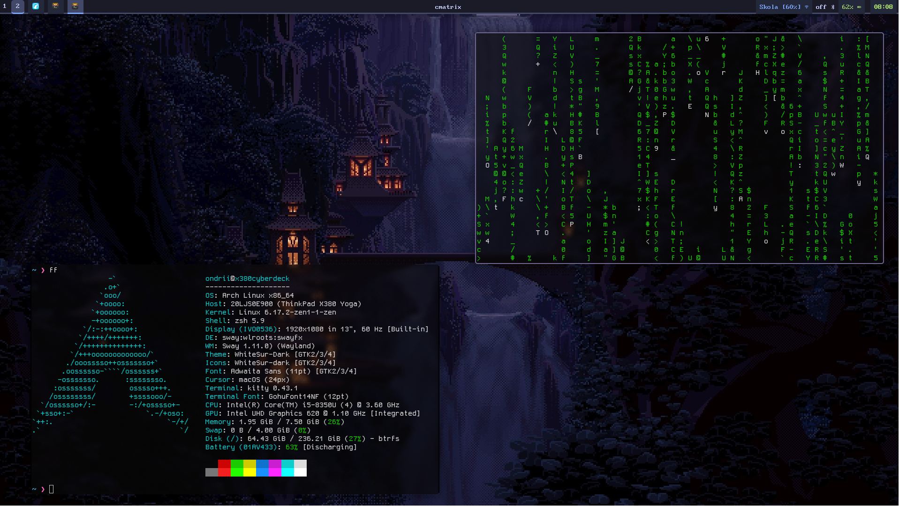

# ✨ SwayWM Dotfiles

Dotfiles for the sway window manager on my Thinkpad X380 Yoga.

Feel free to modify, take inspiration or use my dotfiles! I use these configs on a daily basis, in school, at home, for literally anything, except for gaming. It's a mostly productive and comfort based setup. 

I took me while to get this together, and I want to keep on improving my dotfiles. If you find any issues please address them in the GitHub Issues tab. I'm always looking forward on improving. 

All applications I use are listed here. Most of them is based on experience or recommendation. 

## 🖼️ Screenshots

## 📲 Used applications

Terminal emulator: [kitty](https://sw.kovidgoyal.net/kitty/) 
Application launcher: [fuzzel](https://codeberg.org/dnkl/fuzzel) 
File manager: [nemo](https://github.com/linuxmint/nemo) 
Daily web browser: [chromium](https://www.chromium.org/getting-involved/download-chromium/) 
Privacy web browser: [librewolf](https://librewolf.net/) 
Clipboard manager: [clipman](https://github.com/chmouel/clipman) via [fuzzel](https://codeberg.org/dnkl/fuzzel) 
Screenshot tool: [hyprshot](https://github.com/Gustash/hyprshot) 
Wallpaper daemon: [swww](https://github.com/LGFae/swww) via [waypaper](https://github.com/anufrievroman/waypaper) 
Color picker tool: [hyprpicker](https://github.com/hyprwm/hyprpicker) 
Code editor: [VSCodium](https://github.com/VSCodium/vscodium) or [neovim](https://neovim.io/) 
Notification daemon: [swaync](https://github.com/ErikReider/SwayNotificationCenter) 
Emoji picker: [bemoji](https://github.com/marty-oehme/bemoji) via [fuzzel](https://codeberg.org/dnkl/fuzzel) 
Discord client: [vesktop](https://github.com/Vencord/Vesktop) 
Audio: [pipewire](https://wiki.archlinux.org/title/PipeWire) 
Authentication agent: [polkit-gnome](https://gitlab.gnome.org/Archive/policykit-gnome) 
Status bar: [waybar](https://github.com/Alexays/Waybar) 

Most of scripts provided by: Skajp 

## 📜 Install script

Coming soon.. 

# 🔨 currently in-dev
